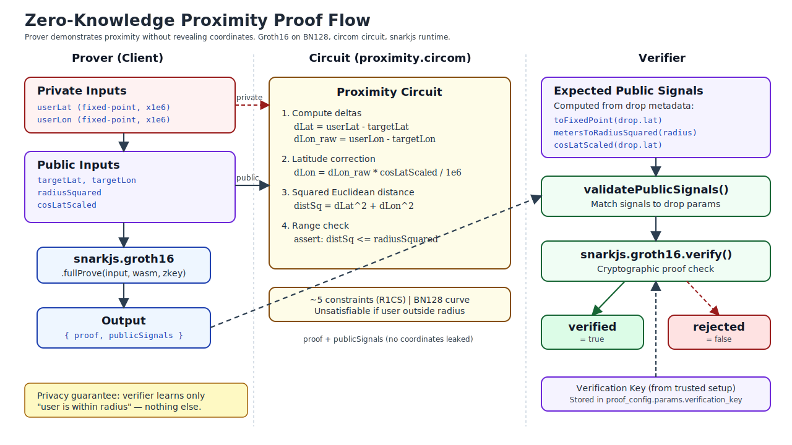
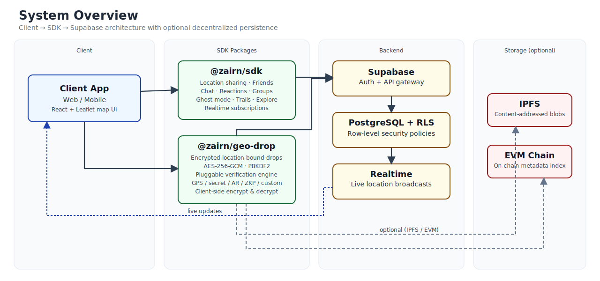
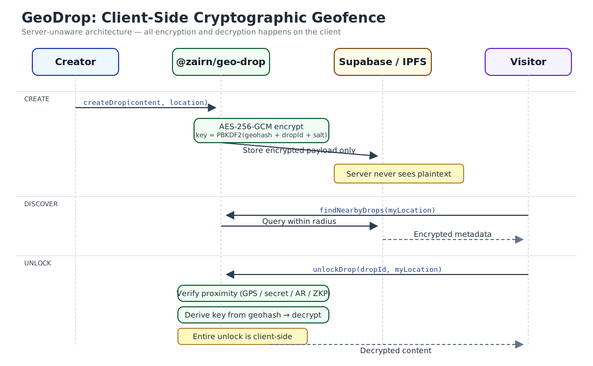
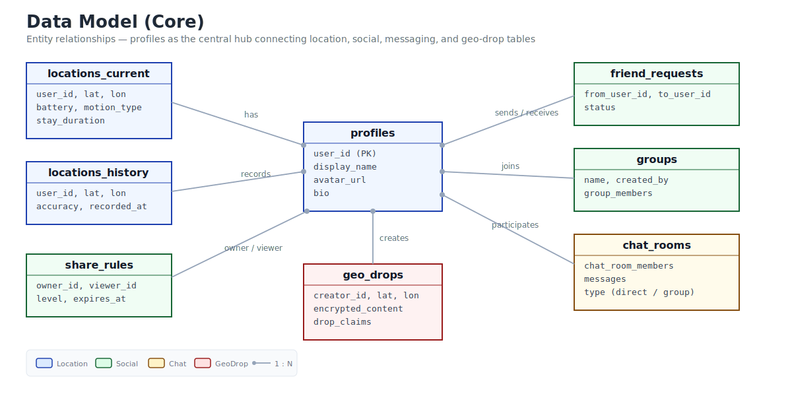

<p align="center">
  
</p>

<p align="center">
  <strong>Privacy-first location stack — real-time sharing, encrypted drops, zero-knowledge proofs</strong>
</p>

<p align="center">
  <a href="https://github.com/zairn-dev/Zairn/actions/workflows/ci.yml"></a>
  <a href="https://doi.org/10.5281/zenodo.19176836"></a>
  <a href="LICENSE"></a>
</p>

---

## What can you build with zairn?

### 1. Build a private social map

Zenly-style real-time location sharing with friends — ghost mode, groups, chat, reactions, trails.

```ts
import { createLocationCore } from '@zairn/sdk';
const core = createLocationCore({ supabaseUrl, supabaseAnonKey });

await core.sendLocation({ lat: 35.68, lon: 139.76, accuracy: 10 });
const friends = await core.getVisibleFriends();
```

### 2. Build geo-anchored encrypted experiences

Leave encrypted content at physical locations. Visitors unlock on-site. For games, art, AR, treasure hunts.

```ts
import { createGeoDrop } from '@zairn/geo-drop';
const gd = createGeoDrop({ supabaseUrl, supabaseAnonKey });

const drop = await gd.createDrop({
  lat: 35.68, lon: 139.76, radiusMeters: 50,
  content: { type: 'text', data: 'Secret message' },
});
// Visitor at location → gd.unlockDrop(drop.id, visitorLat, visitorLon)
```

### 3. Research privacy-preserving location systems

Row Level Security on every table, client-side AES-256-GCM encryption, and Groth16 zero-knowledge proximity proofs — all in one testable stack.

```bash
pnpm test:connection && pnpm test:sdk && pnpm test:features
```

---

## Quick Start

### Option A: Local (no cloud account needed)

```bash
git clone https://github.com/zairn-dev/Zairn.git && cd Zairn
pnpm install

# Requires Docker Desktop running
pnpm db:start          # Starts local Supabase (Postgres + Auth + Realtime + Storage)

# Configure environment with printed credentials
cp .env.example .env   # Uncomment the local lines
cp apps/web/.env.example apps/web/.env.local

pnpm dev:web           # Open http://localhost:5173
```

### Option B: Cloud Supabase

```bash
git clone https://github.com/zairn-dev/Zairn.git && cd Zairn
pnpm install

supabase link --project-ref <your-project-ref>
supabase db push

cp .env.example .env   # Set SUPABASE_URL and SUPABASE_ANON_KEY
cp apps/web/.env.example apps/web/.env.local
pnpm dev:web
```

### Verify installation

```bash
pnpm test:connection   # Database connectivity
pnpm test:sdk          # Location, friends, visibility
pnpm test:features     # Chat, reactions, groups, ghost mode
```

Additional test suites: `pnpm test:auth`, `pnpm test:realtime`, `pnpm test:chat`.

### GeoDrop demo

```bash
cp apps/geo-drop-demo/.env.example apps/geo-drop-demo/.env
pnpm --filter geo-drop-demo dev
```

---

## Features

### Location Sharing (`@zairn/sdk`)

| Feature | Description |
|---------|-------------|
| Real-time location | Share & subscribe to friend locations via Supabase Realtime |
| Friend management | Requests, accept/reject, block, remove |
| Ghost mode | Temporarily hide your location (with optional timer) |
| Groups | Create groups, invite via code, group chat |
| Chat | Direct & group messaging |
| Reactions | Emoji pokes to friends on the map |
| Bump detection | Detect nearby friends |
| Trail recording | Distance-based location history with time-decay visualization |
| Area exploration | Visited cell tracking for gamification |

### GeoDrop (`@zairn/geo-drop`)

| Feature | Description |
|---------|-------------|
| Encrypted drops | AES-256-GCM with location-derived keys; server never sees drop content in plaintext |
| Verification | Pluggable: GPS / secret / AR / ZKP / custom |
| ZK proximity proof | Groth16/snarkjs — prove "within radius R" without revealing coordinates |
| Storage tiers | DB-only → IPFS → EVM on-chain (zero architecture changes) |
| Media | Text / image / audio / video / file |

<p align="center">
  
</p>

---

## Architecture

<p align="center">
  
</p>

### Project structure

```
zairn/
├── packages/
│   ├── sdk/              # @zairn/sdk — location sharing core
│   └── geo-drop/         # @zairn/geo-drop — encrypted geo-drops
│       ├── database/     # GeoDrop schema & RLS
│       ├── contracts/    # Solidity (optional)
│       └── protocol/     # Protocol spec
├── apps/
│   ├── web/              # Main web app (Vite + React 19 + Leaflet)
│   └── geo-drop-demo/    # GeoDrop demo app
├── database/
│   ├── schema.sql        # Core tables & indexes
│   └── policies.sql      # RLS policies (all tables)
└── test/                 # Integration tests
```

### Tech stack

| Layer | Technology |
|-------|-----------|
| Database & Auth | Supabase (PostgreSQL + Auth + Realtime) |
| SDK | TypeScript (ESM) |
| Web | Vite + React 19 + Tailwind CSS 4 + Leaflet |
| Security | Row Level Security on every table |
| Encryption | AES-256-GCM, PBKDF2 (client-side) |
| ZKP | Groth16 via snarkjs + circom |
| Storage | IPFS (Pinata / web3.storage), EVM (optional) |

### GeoDrop cryptographic geofence

```
Content → AES-256-GCM encrypt (key = PBKDF2(geohash + dropId + salt))
                ↓
        Encrypted payload → IPFS or DB (server sees only ciphertext)
                ↓
Visitor at location → Derive same key from geohash → Client-side decrypt
```

<p align="center">
  
</p>

### Data model

<p align="center">
  
</p>

---

## RLS Overview

- Users can only write/update their own data
- Location viewing requires `share_rules` permission
- Friend request acceptance creates bidirectional share rules
- Chat access is restricted to room/group members
- `security definer` helper functions prevent RLS policy recursion
- All tables have RLS enabled — no exceptions

---

## Edge Functions (Production)

```bash
supabase link --project-ref your-project-ref
supabase secrets set PINATA_JWT=your-pinata-jwt
supabase secrets set IPFS_GATEWAY=https://gateway.pinata.cloud/ipfs
supabase functions deploy unlock-drop
supabase functions deploy ipfs-proxy
```

```ts
const geoDrop = createGeoDrop({
  supabaseUrl: '...',
  supabaseAnonKey: '...',
  serverUnlock: true,  // Uses Edge Function for secure unlock
});
```

---

## Contributing

See [CONTRIBUTING.md](CONTRIBUTING.md) for development setup, commit conventions, and guidelines.

We welcome contributions of all kinds — code, documentation, example apps, bug reports, and research.

**Good places to start:**
- Issues labeled [`good first issue`](https://github.com/zairn-dev/Zairn/labels/good%20first%20issue)
- Issues labeled [`help wanted`](https://github.com/zairn-dev/Zairn/labels/help%20wanted)
- [GitHub Discussions](https://github.com/zairn-dev/Zairn/discussions) for questions, ideas, and showcases

## License

[MIT](LICENSE)

## Disclaimer

This project is not affiliated with Zenly, Snap Inc., or Tonchidot (Sekai Camera). It is an independent open-source project inspired by their concepts.
