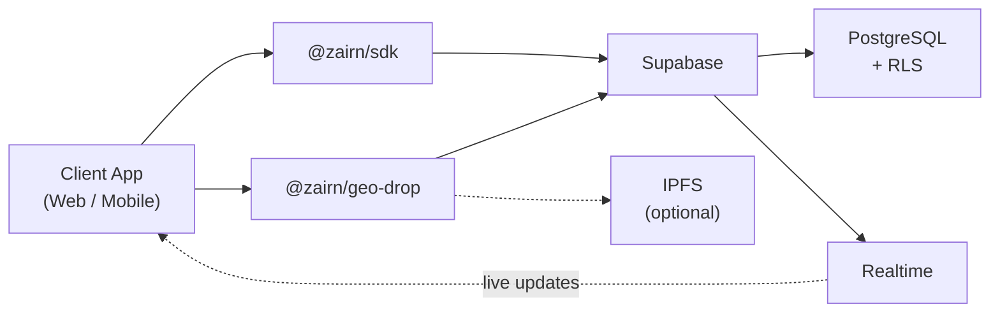
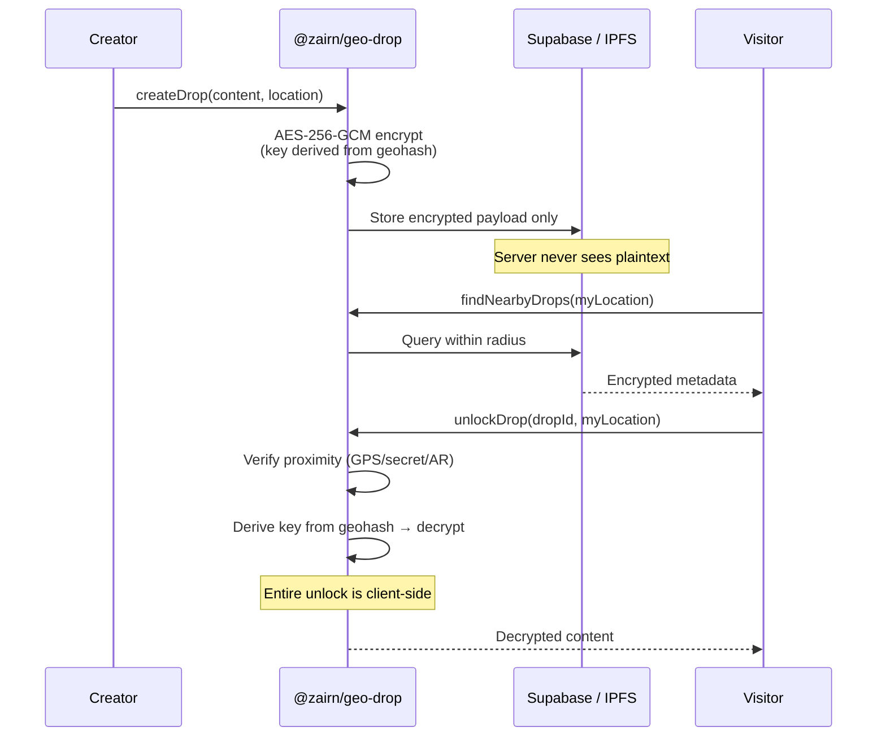
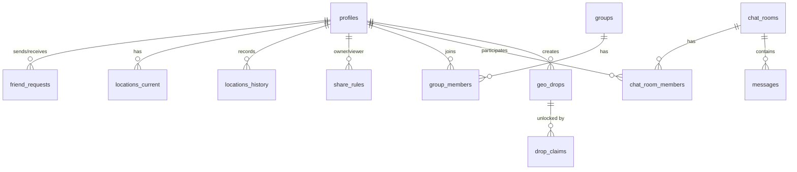

<p align="center">
  
</p>

<p align="center">
  <strong>Open-source location sharing + geo-anchored content platform</strong>
</p>

<p align="center">
  <a href="#features">Features</a> · <a href="#quickstart">Quick Start</a> · <a href="#architecture">Architecture</a> · <a href="CONTRIBUTING.md">Contributing</a>
</p>

---

An open-source location-sharing platform inspired by **Zenly** and **Sekai Camera**. Combining Zenly's real-time friend location sharing with Sekai Camera's vision of leaving digital content anchored to physical locations.

**Open source. Self-hostable. Privacy-first.**

## Why zairn?

Zenly made location sharing fun and meaningful with friends. Sekai Camera pioneered the concept of "air tagging" — attaching digital information to real-world places that others can discover when they visit. Both apps were ahead of their time and are no longer available.

zairn brings back these ideas as a unified open-source platform:
- **Zenly-style social map** — see where your friends are, chat, react, and explore together
- **Sekai Camera-style GeoDrop** — leave encrypted messages, images, and media at real locations for others to discover and unlock on-site

## Features

### Location Sharing (`@zairn/sdk`)
- Real-time location sharing with friends
- Friend requests and management
- Ghost mode (temporarily hide your location)
- Groups for sharing with multiple people
- Direct and group chat
- Location reactions (emoji pokes)
- Bump detection (nearby friends)
- Location history & trail recording
- Area exploration tracking (visited cells)
- Time-limited sharing with expiration

### GeoDrop (`@zairn/geo-drop`)
- Location-bound encrypted data drops
- AES-256-GCM encryption with location-derived keys
- Pluggable verification (GPS / secret / AR / ZKP / custom)
- Zero-knowledge proof of proximity (Groth16/snarkjs)
- IPFS storage (optional — works in DB-only mode too)
- EVM on-chain persistence (optional)
- Image / audio / video / file content support
- Password-protected & private drops

## Tech Stack

- **Backend**: Supabase (PostgreSQL + Auth + Realtime)
- **SDK**: TypeScript
- **Web Frontend**: Vite + React 19 + Tailwind CSS 4 + Leaflet
- **Security**: Row Level Security (RLS) for all data
- **Storage**: IPFS via Pinata / web3.storage (optional)

## Project Structure

```
zairn/
├── packages/
│   ├── sdk/                # @zairn/sdk — location sharing core
│   │   └── src/
│   └── geo-drop/           # @zairn/geo-drop — location-bound drops
│       ├── src/
│       ├── database/       # GeoDrop schema & RLS policies
│       ├── contracts/      # Solidity smart contracts
│       └── protocol/       # Protocol specification
├── apps/
│   ├── web/                # Main web app (map, friends, chat, trails)
│   └── geo-drop-demo/      # GeoDrop demo app
├── database/
│   ├── schema.sql          # Core table definitions and indexes
│   └── policies.sql        # RLS policies for all tables
└── test/                   # Integration tests
```

## Quickstart

### Prerequisites

- Node.js 18+
- [pnpm](https://pnpm.io/) 9+
- A [Supabase](https://supabase.com/) project

### Setup

```bash
# Clone and install
git clone https://github.com/otanl/Zairn.git
cd zairn
pnpm install

# Apply database schema
# Paste database/schema.sql then database/policies.sql in Supabase SQL Editor

# Configure environment
cp apps/web/.env.example apps/web/.env.local
# Edit with your VITE_SUPABASE_URL and VITE_SUPABASE_ANON_KEY

# Start the web app
pnpm dev:web
```

### GeoDrop Demo

```bash
cp apps/geo-drop-demo/.env.example apps/geo-drop-demo/.env
# Edit with Supabase credentials (IPFS key is optional)

# Apply geo-drop tables
# Paste packages/geo-drop/database/schema.sql then policies.sql in Supabase SQL Editor

pnpm --filter geo-drop-demo dev
```

### Edge Functions (Production)

For production deployments, enable server-side unlock to keep encryption keys off the client:

```bash
# Install Supabase CLI
npm install -g supabase

# Link your project
supabase link --project-ref your-project-ref

# Set secrets
supabase secrets set PINATA_JWT=your-pinata-jwt
supabase secrets set IPFS_GATEWAY=https://gateway.pinata.cloud/ipfs

# Deploy functions
supabase functions deploy unlock-drop
supabase functions deploy ipfs-proxy
```

Then enable server-side unlock in the SDK:

```ts
const geoDrop = createGeoDrop({
  supabaseUrl: '...',
  supabaseAnonKey: '...',
  serverUnlock: true,  // Uses Edge Function for secure unlock
});
```

### SDK Usage

```ts
import { createLocationCore } from '@zairn/sdk';

const core = createLocationCore({
  supabaseUrl: 'https://your-project.supabase.co',
  supabaseAnonKey: 'your-anon-key',
});

await core.sendLocation({ lat: 35.0, lon: 139.0, accuracy: 10 });
const friends = await core.getVisibleFriends();

const channel = core.subscribeLocations(row => {
  console.log('location updated', row);
});
```

## Architecture

### System Overview



### GeoDrop: Client-Side Cryptographic Geofence

GeoDrop uses a **server-unaware** architecture. The server never sees plaintext content — all encryption and decryption happens on the client using location-derived keys.

```
Content → AES-256-GCM encrypt (key = PBKDF2(geohash + dropId + salt))
                ↓
        Encrypted payload → IPFS or DB (server sees only ciphertext)
                ↓
Visitor at location → Derive same key from geohash → Client-side decrypt
```

Key properties:
- **No server unlock decision** — The server stores only encrypted blobs and never participates in the unlock process
- **Location = cryptographic key** — Decryption requires knowledge of the geohash, which requires physical proximity
- **Progressive decentralization** — DB-only → IPFS → on-chain, with zero architecture changes

See the full [Protocol Specification](packages/geo-drop/protocol/SPEC.md) for details.



### Data Model (Core)



## RLS Overview

- Users can only write/update their own data
- Location viewing requires permission via `share_rules`
- Friend request acceptance creates bidirectional share rules
- Chat access is restricted to room/group members
- All tables have RLS enabled by default

## Contributing

Contributions are welcome! Please feel free to submit issues and pull requests.

## License

This project is licensed under the MIT License - see the [LICENSE](LICENSE) file for details.

## Disclaimer

This project is not affiliated with Zenly, Snap Inc., or Tonchidot (Sekai Camera). It is an independent open-source project inspired by their concepts.
